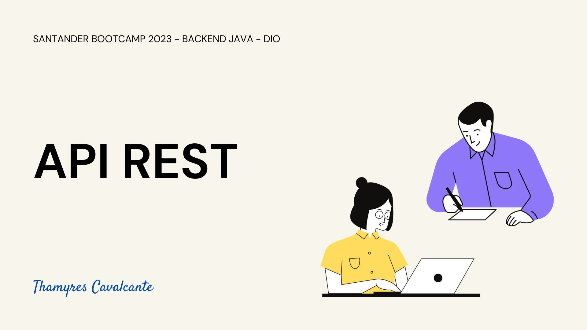
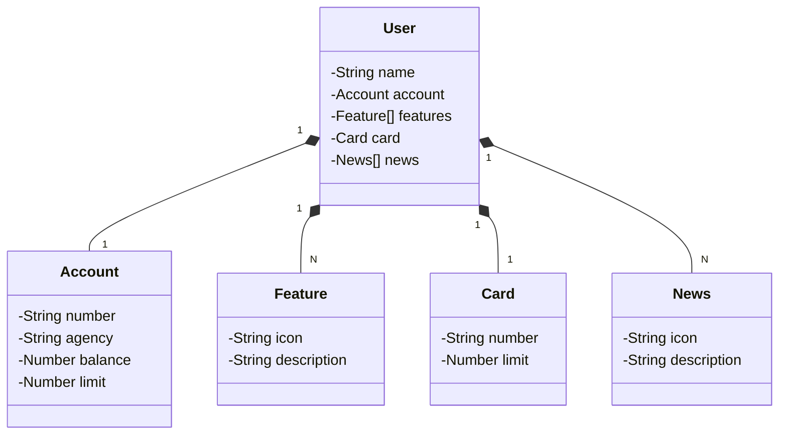

| Desafio | BOOTCAMP SANTANDER 2023 - DIO  |
| -------------  |--------------------------------|
| Nome        | **API REST usando Spring Boot 3, Java 17**  
| Tecnologias | Java, Spring Boot, Spring Data JPA, OpenApi            
| URL         | https://github.com/Thamyresmya/Desafio5_Santander_Dio-API-REST

# API REST usando Spring Boot 3, Java 17

## 🚀 Tecnologias

Esse projeto foi desenvolvido com as seguintes tecnologias:

- `Java 17`
- `Spring Boot 3`
- `Spring Data JPA`
- `OpenAPI (Swagger)`
- `MySQL`

## ✨ Projeto
Projeto desenvolvido junto com o instrutor durante o curso para o Bootcamp Santander Back End 2023. Java API RESTful.

## 🎯 FIGMA

O Figma foi utilizado para a abstração do domínio desta API, sendo útil na análise e projeto da solução.
[Link](https://www.figma.com/file/0ZsjwjsYlYd3timxqMWlbj/SANTANDER---Projeto-Web%2FMobile?type=design&node-id=1421%3A432&mode=design&t=6dPQuerScEQH0zAn-1)

## 💫 Diagrama de classe

## Documentação da API (Swagger)

[Swagger](http://localhost:8080/swagger-ui/index.html) 

## 🔗 Me siga nas redes sociais:
- [Linkedin](https://www.linkedin.com/in/thamyrescavalcante/)
- [Instagran](https://www.instagram.com/thamyres__cavalcante/)

 

---

### Feito com 💜 by Thamyres Cavalcante